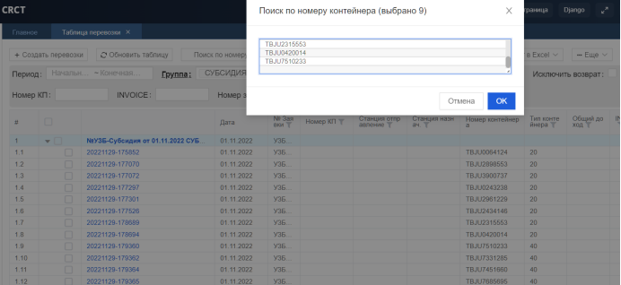

# 🆕 Инструкция по вводу расходы Субсидия, Хранение, Ремонт для отдела контейнерный и экспортный

## **Инструкция по вводу расходы Субсидия, Хранение, Ремонт для отдела контейнерный и экспортный**

**1. Перейти на сайт** [**https://my.crct.kz**](https://my.crct.kz)**, Перейти на страницу "Таблица переовзки"**

&#x20;

**2. Установить Фильтыр на Группа**

<figure><figcaption></figcaption></figure>

**3. Нажмите на “Посик по номеру контейнера” и вставьте номеры контейнеров**

<figure><figcaption></figcaption></figure>

**4. Затем выберите контейнеры, которые вы хотите добавить расходы**

<figure><figcaption></figcaption></figure>

**5. Затем нажмите на кнобку “Массовый редактировать таблицу расходовдоходов”**

<figure><figcaption></figcaption></figure>

**6. И нажмите на кнобку “Добавть Расходы” чтобы добавить столбец в таблицу**

<figure><figcaption></figcaption></figure>

**7. Заполните таблицу и нажмите сохранить**

<figure><figcaption></figcaption></figure>
